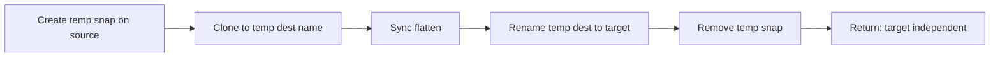
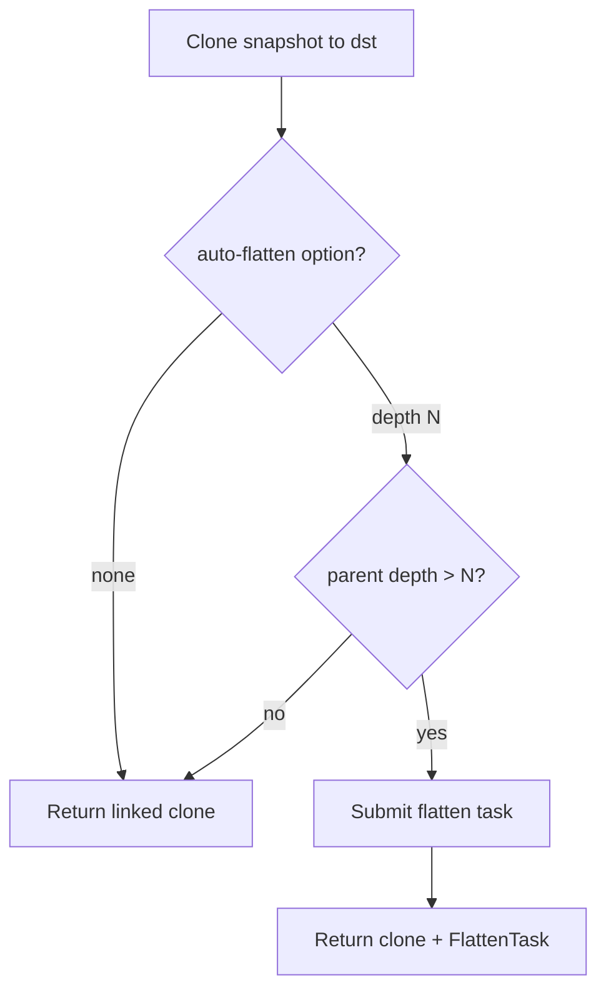

# RBD Copy, Clone, and Flatten

This document explains how **copy**, **clone**, and **flatten** interact in go-ceph: what each operation does, when flatten runs, and how to use the CLI and Go APIs.

## Concepts

### Clone

A **clone** is a new RBD image that shares data with a parent snapshot through copy-on-write. The clone remains linked to its parent until it is **flattened**.

- A clone can be opened and used immediately, even before flatten completes.
- While the clone has a parent, the parent snapshot must remain available (and protected, when required by Ceph).

### Flatten

**Flatten** breaks the clone link by copying shared data into the child image. After flatten, the image is **independent** and no longer depends on the parent snapshot.

Flatten can run:

| Mechanism | API | Blocking |
|-----------|-----|----------|
| Synchronous | `image.Flatten()` via librbd | Caller waits until complete |
| Background task | `rbd task add flatten` (Ceph mgr) | Caller returns after task submission |

### Copy vs clone in go-ceph

| Operation | Purpose | Produces independent image? |
|-----------|---------|----------------------------|
| `RbdClone` | Create a **linked clone** from a snapshot | Only if optional auto-flatten is triggered |
| `RbdCopy` / `RbdCopySnap` | Create a **point-in-time copy** of an image or snapshot | Yes (always flattens synchronously) |
| `RbdCopyUnsafe` | Copy image head via librbd `Copy` | Yes (no clone/flatten path) |

**Copy** always ends with an independent destination image visible only after success. **Clone** creates a linked clone by default; auto-flatten is optional and runs in the background.

## Configuration layers

### `CopyOption` and `CloneOption`

Functional options for copy and clone. Pass zero or more options; later options override earlier ones for the same setting.

```go
rbd.RbdCopy(ctx, conn, src, dst,
    rbd.CopyWithImageOptions(rbd.RbdOptDefault()),
)

rbd.RbdClone(ctx, conn, srcSnap, dst,
    rbd.CloneWithImageOptions(rbd.RbdOptDefault()),
    rbd.CloneWithAutoFlattenDepth(3),
)
```

| Helper | Operation | Effect |
|--------|-----------|--------|
| `CopyWithImageOptions` | Copy | librbd image options for destination clone |
| `CloneWithImageOptions` | Clone | librbd image options for destination clone |
| `CloneWithoutAutoFlatten` | Clone | disable auto-flatten (default) |
| `CloneWithAutoFlattenDepth(n)` | Clone | submit flatten task when `depth > n` (`n=0` always flattens) |

### `RbdImageOption` / `RbdOptFlatten` — librbd clone options

`RbdOptFlatten` sets `RBD_IMAGE_OPTION_FLATTEN` on the librbd `ImageOptions` passed to clone APIs. This is a **different layer** from `CloneWithAutoFlattenDepth`.

### `RbdFlatten` — explicit flatten

`RbdFlatten(ctx, conn, imageSpec)` flattens an existing image synchronously. Use this when you want flatten as a standalone step, equivalent to `rbd flatten`.

## Flatten behavior

### Copy (`RbdCopy`, `RbdCopySnap`)

Copy **always** flattens synchronously. There is no flatten option.

| On success | On failure |
|------------|------------|
| Destination exists at `dstImageSpec`, flattened and independent | `dstImageSpec` is not created |

Copy uses a **temporary destination** name (`target__temp__<random>`), flattens it, then renames to the final target so the final name only appears when the image is independent.

### Clone (`RbdClone`)

Clone **optionally** submits a background flatten task after creating the linked clone.

| Mode | Option | CLI `--flatten` | On return |
|------|--------|-----------------|-----------|
| None (default) | (none) | `none` or empty | Linked clone only |
| Depth | `CloneWithAutoFlattenDepth(n)` | `N` (0..15) | Linked clone; flatten task submitted if triggered |

**Parent depth** is `len(RbdParents(dst))` after clone. Auto-flatten runs when:

```text
parent_depth > N   (0 <= N <= 15)
```

`N=0` always flattens (a fresh clone always has depth at least 1). Ceph caps the clone-on-write parent chain at `RBD_MAX_PARENT_CHAIN_LEN` (16 levels); a child image can sit at most 15 levels below the original base image.

Examples after clone:

| Parent depth | `--flatten 0` | `--flatten 2` |
|--------------|------------|------------|
| 1 | Flatten (1 > 0) | Skip (1 <= 2) |
| 3 | Flatten | Flatten (3 > 2) |

`RbdClone` only **submits** the flatten task; it does not wait for completion or clean up snapshots.

## Operation flows

### `RbdCopy` — image head to new image

Creates a **temporary snapshot** on the source for point-in-time consistency, clones from it into a temporary destination, flattens, renames, then removes the temporary snapshot.



1. Clone into `target__temp__<random>`.
2. Flatten synchronously.
3. Rename to final `target`.
4. Unprotect and remove the temporary source snapshot.

The call returns when `target` is flattened and independent. On failure the temporary destination is removed and `target` is never created; the temporary snapshot is still cleaned up.

### `RbdCopySnap` — existing snapshot to new image

Same staging and flatten semantics as `RbdCopy`, but clones from an **existing** snapshot instead of creating a temporary one.

- The source snapshot is **protected** if not already protected (required for clone).
- Protection is **not** removed after the operation; the snapshot stays protected.
- No temporary source snapshot is created or removed.

### `RbdCopyUnsafe` — direct librbd copy

Uses librbd `Copy` on the image head. No snapshot, clone, or flatten path. May be inconsistent if the source is written during copy. Also uses a temporary destination and rename.

### `RbdClone` — linked clone

Creates a clone in the **same pool and namespace** as the source snapshot.



No temporary snapshots are involved. The call does not wait for flatten or clean up snapshots.

## Return value: `*FlattenTask`

```go
type FlattenTask struct {
    ID string `json:"id,omitempty"`
}
```

Returned only by `RbdClone` when a background flatten task is submitted.

| Situation | Return |
|-----------|--------|
| No flatten or depth not exceeded | `nil, nil` on success |
| Flatten task submitted | `&FlattenTask{ID: "..."}, nil` |
| Error | `nil, err` |

`RbdCopy` and `RbdCopySnap` return only `error`.

The task ID can be queried with `RbdTaskGet` or the CLI:

```bash
goceph ceph rbd task list <task-id>
```

## CLI usage

### Copy

```bash
# Always sync flatten; destination independent on return
goceph rbd cp pool/src pool/dst

# Copy from snapshot spec
goceph rbd cp pool/src@snap pool/dst

# Direct head copy (may be inconsistent)
goceph rbd cp pool/src pool/dst --unsafe
```

### Clone

```bash
# Default: linked clone, no flatten
goceph rbd clone pool/src@snap pool/dst

# Submit background flatten when parent depth > 3
goceph rbd clone pool/src@snap pool/dst --flatten 3

# Always submit background flatten (depth > 0)
goceph rbd clone pool/src@snap pool/dst --flatten 0
```

When a flatten task is submitted, the command prints JSON:

```json
{
  "id": "<mgr-task-id>"
}
```

### `--flatten` values

| Command | Valid values | Default |
|---------|--------------|---------|
| `rbd cp` | (none) | always sync flatten |
| `rbd clone` | `none`, `0`..`15` | `none` |

Parse programmatically with:

```go
opt, err := rbd.ParseCloneAutoFlattenOption("3")
// pass opt to RbdClone when non-nil
```

## Go API examples

### Copy

```go
err := conn.RbdCopy(ctx, src, dst)
// on success, dst is independent

err := conn.RbdCopy(ctx, src, dst, rbd.CopyWithImageOptions(rbd.RbdOptDefault()))
```

### Clone without flatten

```go
task, err := conn.RbdClone(ctx, srcSnap, dst)
// task == nil, dst is a linked clone
```

### Clone with conditional auto-flatten

```go
task, err := conn.RbdClone(ctx, srcSnap, dst,
    rbd.CloneWithAutoFlattenDepth(3),
)
// task != nil when flatten was triggered; flatten runs in background
```

## Operational notes

### Copy failure leaves no final target

If clone or flatten fails during `RbdCopy` / `RbdCopySnap`, the temporary destination is removed and `dstImageSpec` is never created. Retry is safe without manual cleanup of the destination name.

### Clone auto-flatten is fire-and-forget

`RbdClone` does not wait for the flatten task. Monitor task status via `RbdTaskGet` or `goceph ceph rbd task list` if you need completion guarantees. On task failure the destination remains a valid linked clone; no snapshot cleanup is involved.

## Related APIs

| API | Role |
|-----|------|
| `RbdFlatten` | Explicit synchronous flatten of an existing image |
| `RbdTaskAddFlatten` | Submit flatten task without copy/clone |
| `RbdParents` | Inspect clone chain depth for clone flatten decisions |
| `RbdOptFlatten` | Librbd image option at clone time (separate from `CloneOption`) |

## Quick reference

```text
                    Copy (RbdCopy*)          Clone (RbdClone)
                    ----------------         -----------------
Default flatten     Always (sync)            None
Options arg         ...CopyOption            ...CloneOption
Auto-flatten        —                        CloneWithAutoFlattenDepth
Valid modes         —                        none, 0..15
Return on success   error only               nil or *FlattenTask
Independent image   Always on success        Only if auto-flatten runs
Temp dest image     Yes (rename after)       No
Temp source snap    RbdCopy only             No
```
